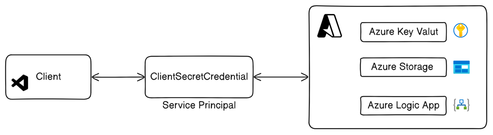

# Services  

  

The **Services** module is a generic utility designed to help developers seamlessly interact with various **Azure services** from their development environment using an **Azure Service Principal**.  

This module provides essential utilities to perform operations on:  
- **Azure Key Vault**  
- **Azure Blob Storage**  
- **Azure Logic Apps**  

## Features  

1. **Identity Module**  
   - Manages authentication and interactions with **Azure Key Vault** for secure secrets management.  

2. **Messaging Module**  
   - Enables sending **emails** via **Azure Logic Apps**.  

3. **Storage Module**  
   - Facilitates **Blob List operations** on **Azure Blob Storage**.  

---

Let me know if you need further refinements! 🚀

